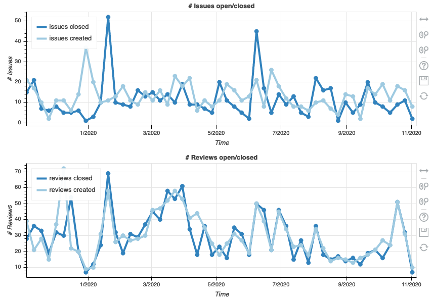
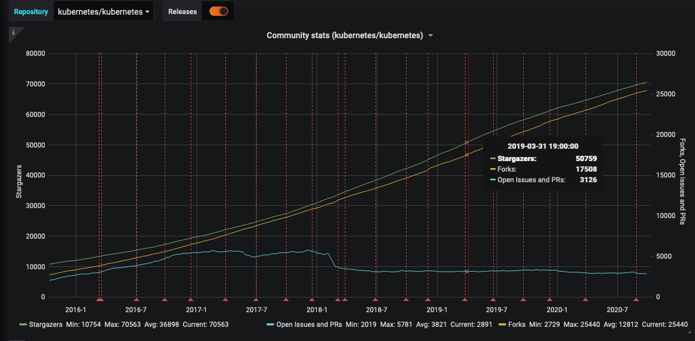

# Project Popularity
Question: How popular is an open source project?  

## Description  
Project popularity can be measured by how much activity is visible around a project. Popularity has a positive feedback loop in which more popular projects get more attention, attract more users or developers, and see increases in popularity, spinning the popularity wheel.

Project popularity may be used as a proxy for understanding project value because open source project economic value is hard to measure, due to a lack of available usage or sales information for open source projects.

## Objectives  
In a quest to earn a living wage, and to maximize future employment opportunities, workers may be interested in knowing which projects are growing and are underserved. Similarly, from an organizational perspective, knowing which projects are highly used can be helpful in knowing which projects might be worth investing in. The Project Popularity metric can be used to identify the trajectory of a project’s development.

## Implementation
The project popularity metric is often considered with changes over time. There are numerous example vectors to consider when measuring project popularity based on the number of:

1. Social media mentions
1. Forks
1. [Change requests](https://chaoss.community/metric-change-requests/)
1. [New Issues](https://chaoss.community/metric-issues-new/)
1. Stars, badges, likes
1. [New contributors](https://chaoss.community/metric-new-contributors/)
1. [Organizational Diversity](https://chaoss.community/metric-organizational-diversity/)
1. Job postings requesting skills in project
1. Conversations within and outside of project
1. Clones
1. Followers
1. Downstream dependencies
1. People attending events that focus on a project

### Visualizations

Issues and reviews (change requests) visualization from Cauldron (GrimoireLab):

Kubernetes project popularity statistics from DevStats:

### Tools Providing the Metric
* [Augur](https://github.com/chaoss/augur)
* [GrimoireLab](https://chaoss.github.io/grimoirelab/)
* [Cauldron](https://cauldron.io/)
## References
- [Popular OpenSource Projects](http://blog.honeypot.io/most-exciting-open-source-projects-2018/)
- [Is It Maintained?](https://isitmaintained.com/)
- [Open Source Project Trends](https://github.blog/2018-02-08-open-source-project-trends-for-2018/)
- [Kubernetes Salary](https://www.payscale.com/research/US/Skill=Kubernetes/Salary)
