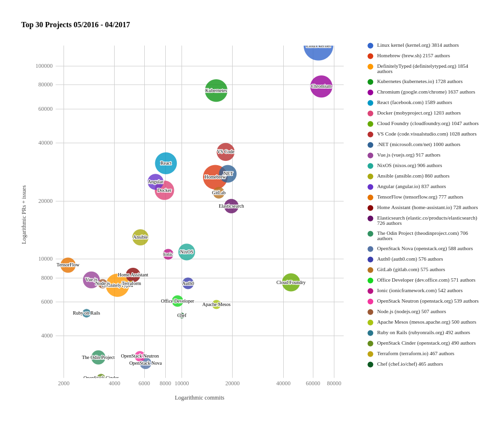

# Project Velocity

Question: What is the development speed for an organization?

## Description

Project velocity is the number of issues, the number of pull requests, volume
of commits, and number of contributors as an indicator of 'innovation'.

## Objectives

Gives an Open Source Program Office (OSPO) manager a way to compare the project
velocity across a portfolio of projects.

The OSPO manager can use the Project Velocity metric to:

- Report project velocity of open source projects vs in-house projects
- Compare project velocity across a portfolio of projects
- Identify which projects grow beyond internal contributors (when filtering internal vs. external contributors)
- Identify promising areas in which to get involved
- Highlight areas likely to be the successful platforms over the next several years

[See Example](https://www.cncf.io/blog/2017/06/05/30-highest-velocity-open-source-projects)

## Implementation

Base metrics include:

- [issues closed](https://github.com/chaoss/wg-evolution/blob/master/metrics/Issues_Closed.md)
- [number of reviews](https://github.com/chaoss/wg-evolution/blob/master/metrics/Reviews.md)
- [# of code changes](https://github.com/chaoss/wg-evolution/blob/master/metrics/Code_Changes.md)
- [# of committers](https://github.com/chaoss/wg-risk/blob/master/metrics/Committers.md)

### Filters

* Internal vs external contributors
* Project sources (e.g., internal repositories, open-source repositories, and competitor open-source repositories)
* Time

### Visualizations

* X-Axis: Logarithmic scale for Code Changes
* Y-Axis: Logarithmic scale of Sum of Number of Issues and Number of Reviews
* Dot-size: Committers
* Dots are projects

[From CNCF](https://www.cncf.io/blog/2017/06/05/30-highest-velocity-open-source-projects/)

### Tools providing the Metric

* CNCF - https://github.com/cncf/velocity

## References

- [Can Open Source Innovation work in the Enterprise?][l1]
- [Open Innovation for a High Performance Culture][l2]
- [Open Source for the Digital Enterprise][l3]
- [Highest Velocity Open Source Projects][l4]

[l1]: https://www.threefivetwo.com/blog/can-open-source-innovation-work-in-the-enterprise

[l2]: https://www.nearform.com/blog/want-a-high-performing-culture-make-way-for-open-innovation

[l3]: https://www.cio.com/article/3213146/open-source-is-powering-the-digital-enterprise.html

[l4]: https://www.cncf.io/blog/2017/06/05/30-highest-velocity-open-source-projects
