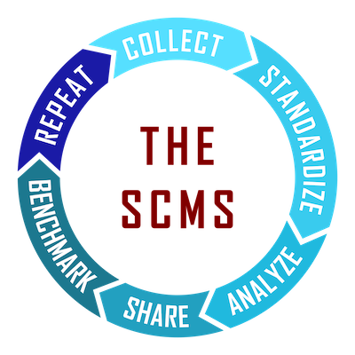
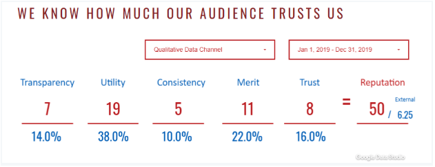
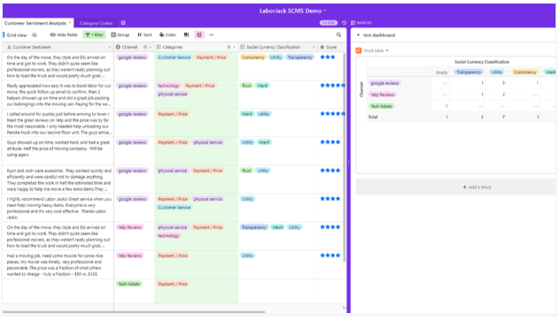
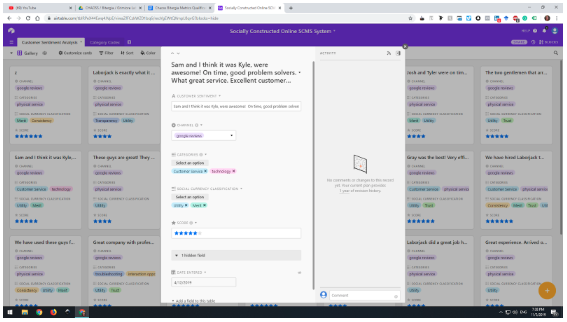

# Social Listening

Question: How does one measure the value of community interactions and accurately gauge “reputation” of a community as evident from qualitative sentiment?

*Note: This metric synthesizes several other metrics that can be derived from trace data, and several process-oriented metrics. Embedded footnotes annotate areas planned for later clarification, and questions for later resolution.*

## Description

Social Listening is a combination of [social listening](https://blog.hubspot.com/service/social-listening) practices across multiple channels along with a meaningful set of categorizations. The combination of these tactics can lead to systematic community analysis and can inform a community strategy that leads to measurable business value. 1

**Theory and Origin**

Social currency or social capital is a social scientific theory. It broadly considers how human interactions build relationships and trust in a community. The Social Listening metric represents the reputation of a community as measured via community trust, transparency, utility, consistency, and merit.

Interpersonal relationships are the social fabric of communities. This is shown in the [Levinger’s Relationship Model](https://theadminzone.com/ams/levingers-stage-theory.1272/) and [Social Penetration Theory](https://psycnet.apa.org/record/1973-28661-000). Community members' sense of personal and group identity grows as they interact. Members build shared values, accumulate a sense of trust, encourage cooperation, and garner reciprocity through acts of [self-disclosure](https://en.wikipedia.org/wiki/Self-disclosure). These interactions build an increased and measurable sense of connection. The measure of these characteristics is called social currency. 2

**Results**

The Social Listening metric is a way to sort through a fire hose of qualitative data from community interactions. A central premise of this approach is that community members' interactions have an impact on the community. The Social Listening metric continually measures the sentiment 3 from those interactions. It illustrates the reputation and level of trust between community members and leaders. 4

## Objectives

Analyze the qualitative comments in community interactions. Gain an overview of sentiment in a community. Get metrics that show at a glance how a community is and was doing. Use lead metrics from continuous measurements for proactive community strategy development. Instill trust in community members that their thoughts and opinions are valued.

## Implementation

The Social Listening requires the collection of community comments (communication traces), the definition of a codex, and the on-going review of the communication traces. 5

Set up a Data Collection Platform of your choice as described in the “Tools” section below. Ensure it has a minimum of 4 dimensions and 3 communication channels. Once it is set up, the following method is used to collect, analyze, and interpret results:

1. **Collect Communication Traces** --
 Identify online platforms that your community is communicating on. Set up data funnels from the primary platform to your Social Listening tool. The critical data for the system is user generated content.

2. **Standardize How Communication Traces Should Be Assessed** --
 Use a codex to define important concepts as a “tracking keyword” or “category”  in the focal community. This unified codex of terms ensures consistent analysis as different people read and tag community sentiment. Formalizing the revision and addition structure to this codex on a regular basis is a must. 5

3. **Analyze the Communication Traces** --
 Community sentiment is analyzed in the Social Listening tool by tagging data with codex terms. If the tagging is done by a team of people, it is recommended that everyone gets together regularly to discuss trends and ensure consistent tag use. If the tagging is done by an artificial intelligence algorithm, then a human team should supervise and retrain the AI as necessary. 5

4. **Share and Visualize the Aggregated Analysis** --
 Visualize the quantitative count of codex terms over time, e.g., in a dashboard. This is where the qualitative analysis results produce an easy to observe dashboard of trends. Share analysis with team members. 6

5. **Benchmark, Set Goals & Predict Future Growth** --
 After getting enough data to form a benchmark, take stock of where your community stands. What are its strengths and weaknesses? What actions can be taken to make the community healthier and more robust? Then form community initiatives with well-defined goals and execute on these projects to affect the social currency metrics for next week. 6

6. **Repeat the Process** --
 In regular evaluation meetings, discuss the shortcomings of the dataset or collection methods. Come up with methods to address these shortcomings in the future. Work solutions into the system and move forward. Truth is in the trend, power is in the pattern.7

### Filters

1. **Channel**: Sort by where the data was collected from.
2. **Tag**: Show data based on what codex tags were used to identify sentiment in comments.
3. **Time**: Show trends in the data over time and pull specific data-sets.
4. **Most impactful comments**: Sort and filter by flags that can be placed in the data to highlight specific data points and explain their importance.
5. **AI vs. Human tagged**: Filter by whether tags were applied programmatically or by a person.
6. **Weighted currency:** Weight the “importance” of certain comments based on any one individually selected criteria. A resulting weighted view is simply a re-order of information based on weight.

### Visualizations

**Dashboard visualizing the aggregate metrics:**

**Example Social Listening tool:** On the left, raw community comments are shown and tags are added in columns immediately to the right. On the right, a pivot table shows in numbers how often tags occurred in combination with other tags.

**Expanded comments view:** remove the “quantitative” from the fields and provide the best possible way to read the different comments.  

### Tools Providing the Metric

To implement the metric any MySQL, smart-sheet, excel, or airtable-like excel datasheet program works fine. This data should be simplified enough to interact with other data interfaces to ensure that data migration is simple, straightforward, and can be automated (such as google data studio). This requires that systems used to implement the Social Listening metric work with CSV and other spreadsheet files, and we heavily recommend open source programs for its implementation.

Once you have this, create a data set with the following data points: 8

| Data Points | Description |
|---|---|
| Date of entry| Date data was imported to Social Listening tool|
| Date of comment| Date comment was made on original platform|
| Comment Text| Qualitative data brought in. Decide on how large you want these chunks ported. Some may port an entire email while others will be broken into one row per sentence. It should only have one “sentiment”|
| Data channel| Originating data channel the comment came from |
| Tags (created on codex document below) | Based on the unified codex of terms, decide what tags to track. There can be two kinds of tags. On the one hand, tags can be based on “themes” or recurring sentiment that people voice (e.g., gamer gate, flamewar, or thank you notes). On the other hand, tags based on “categories” can describe different aspects of a community that members comment on (e.g., events, release, or governance). |
| Social Currency Metric| The social currency being awarded or demerited in the system. This will directly affect numbers.|
| Weighted Score | Once you’ve decided what your “weight” will be, you can assign a system of -3 to +3 to provide a weighted view of human-tagged metrics (AI will not assign a weight for several reasons). This enables the “most impactful comment” filter.|

Create a second sheet for the Unified Codex of Terms which will define terms. It should look like this: 8

| Category Term | Definition | When to use | When not to use |
|---|---|---|---|
| [Custom Tags - themes and categories] | | | |
| [Community specific jargon]| | | |
| Social Currency Dimensions:| | | |
| TRANSPARENCY | Do people recognize and feel a connection to your community?  |When they have the "words" to pinpoint why they feel you are authentic or personable.|This is not about good customer service, or doing well.  That is utility.  This is about whether they understand who you are as a business and show they are onboard with it.|
| UTILITY | Is your community doing something useful or is it contributing value? |Provide parameters that exclude when the term is used so that people know when the category tag should not be implemented.|This is not about good customer service, or doing well.  That is utility.  This is about whether they understand who you are as a business and show they are onboard with it.|
| CONSISTENCY | Do you have a history of being reliable and dependable?  |When they suggest they have used your brand, or interacted with you several times |If they've only provided their comment to suggest you were useful once, use utility instead.|
| MERIT | Does your community merit respect and attention for your accomplishments? |When the social currency garnered from customers seems it will continue for a while, and will impact other people's opinions.|When they suggest they will use you again in the future use trust instead as that is a personal trust in the brand. Merit is external.|
| TRUST | Can people trust that your community will continue to provide value and grow in the future? |When they suggest they trust you well enough to continue conversations with you in the future|When there is not substantial enough evidence to suggest they will continue to work with and trust you as a loyal customer or community member.|
| INTERNAL REPUTATION 9 | Do people believe these things strongly enough to warrant conversation or action? | | |
| EXTERNAL REPUTATION 9 | What amount of your reputation in your community is transferable to strangers outside of your community (cold audiences)? | | |

The codex is filled in by stakeholders on a regular basis by specific communities and forms the basis for analysis of the data. This is the MOST IMPORTANT part. Without this the subjectivity of qualitative data does not follow the rule of generalization: 9

> “A concept applies to B population ONLY SO FAR AS C limitation.”

### Data Collection Strategies

Community member comments are available from trace data. The Social Listening metric ideally imports the comment text automatically into a tool for tagging. Trace data can be collected from a communities' collaboration platforms where members write comments, including ticketing systems, code reviews, email lists, instant messaging, social media, and fora.

**Legal and Regulatory Considerations**

_Points of destruction_: Detailed data is destroyed after _xx_ months has passed. Quantitative calculations are kept for up to 250 weeks per GDPR compliance. Data older than 250 weeks becomes archived data you cannot manipulate but can see. Users can negotiate the primary statistic.

## References

- [An example implementation on airtable](https://airtable.com/invite/l?inviteId=inv8u49VVMtQTrfFU&inviteToken=c49b1ed3759c5cd736901fd81c9f460f86e8e9f462703c4f85a3bdd7250ca5a7)
- [An example implementation in data studio](https://datastudio.google.com/open/1X9UdQz8FtHHmjMBpjba3pFqE55lNpwg5)(report)
- [An example implementation in data studio](https://datastudio.google.com/open/1Z4EJ03898lZxm2NZVULaEoLS0bYqL79A) (data source)
- [An example implementation in google sheets](https://drive.google.com/open?id=1zi3JE0bwfEdRdc-wQEZn8GaB7sE8IvxeSeqvVywKnXw)
- [Implementation documentation](https://docs.google.com/document/d/1RlAedRBQbhq0oYMCB3VqdawOCZE2XT5R3teydjBZODM/edit#heading=h.8hyunaadfriq) (starts on page 33)

## Annotated Footnotes

1 CHAOSS metrics historically is to create standard definitions that can be used reliably across projects to support comparisons. This metric may evolve into a project in the future.

2 What metrics emerge from this description? Likely included are: 1. community trust, 2. transparency,  3. utility, 4. consistency, and 5. merit

3 Analysis of sentiment suggests that metric (6) is likely "Communications Sentiment", and the definition may need to include references to common sentiment analysis tools, sometimes called "bags of words".

4 Measuring how trust trust is instilled in community members, such that their thoughts and opinions are valued is likely metric (7) that will define a process, and perhaps is not measurable via trace data.

5 A substantial portion of any codex for open source software will be common across projects, and each project is likely to have a set of particular interests that are a subset of that codex. In some cases, their main interests may not be present in an established codex component. In general, the codex, like the CHAOSS project itself, is open sourced as shared metadata to ensure shared understanding across open source communities.

6 This describes the evolution of a standard codex, and its elements through the process of CHAOSS working groups and projects, characterized in the previous footnote. Likely this will be a process metric (8).

7 Candidate process oriented metric (9).

8 Examples of data coded using the open sourced codex, as it evolves, will be essential components for advancing open source software through Social Listening. Implementations will require these examples, and their provision as open source assets of the CHAOSS project will return value as shared data.

9 Internal and external reputation are likely metrics (10), and (11) arising from the Social Listening metric.
