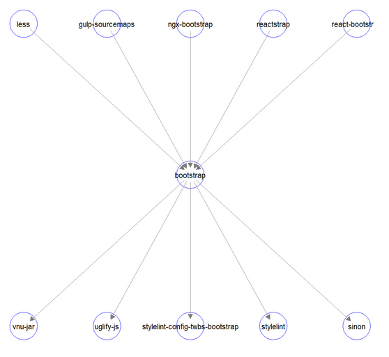
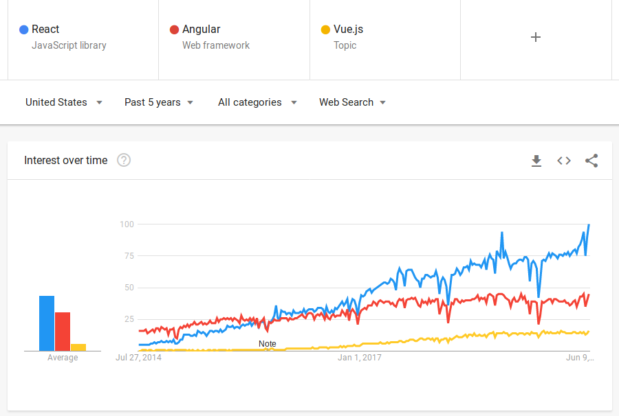
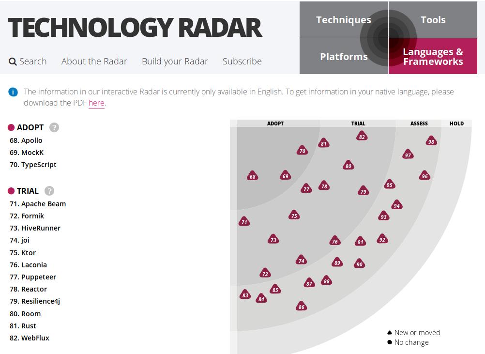
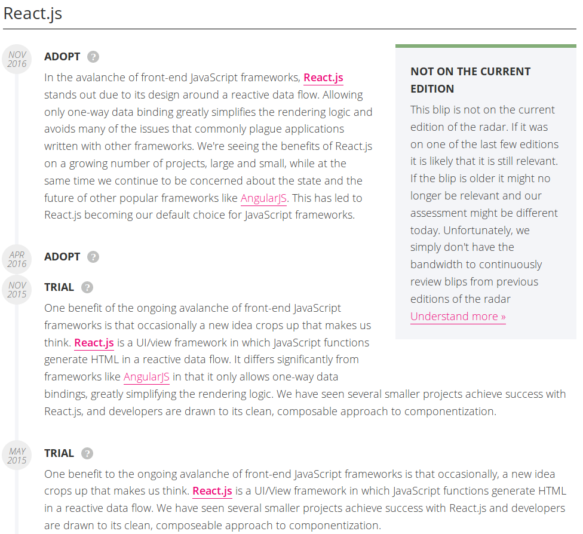
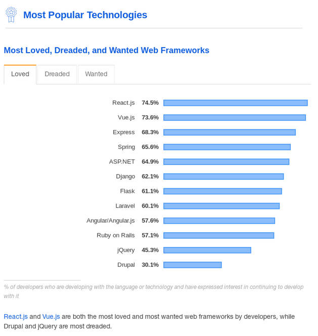

# Organizational Project Skill Demand

Question: How many organizations are using this project and could hire me if I become proficient?

## Description

Organizations engage with open source projects through use and dependencies. 
This metric is aimed at determining downstream demand of skills related to 
an open source project. This metric looks at organizations that deploy a 
project as part of an IT infrastructure, other open source projects with 
declared dependencies, and references to the project through social media, 
conference mentions, blog posts, and similar activities.

## Objectives

As a developer, I'd like to invest my skills and time in a project that has a
likelihood of getting me a decent paying job in the future. People can use the
Downstream Organizational Impact of a Project Software metric to discover which
projects are used by organizations, and they may, therefore, be able to pursue
job opportunities with, possibly requiring IT support services.

## Implementation

Base metrics include:
- Number of organizations that created issues for a project
- Number of organizations that created pull requests for a project
- Number of organizations that blog or tweet about a project
- Number of organizations that mention a project in open hiring requests
- Number of organizations that are represented at meetups about this project
- Number of other projects that are dependent on a project
- Number of books about a project
- Google search trends for a project

### Visualizations

The following visualization demonstrates the number of downstream projects
dependendent on the project in question. While this visualization does not
capture the entirety of the Downstream Organizational Impact of a Project
Software metric, it provides a visual for a portion.

Other visualizations could include Google search trends (React vs. Angular vs. Vue.js)

ThoughtWorks publishes a series called 'Tech Radar' that shows the popularity of technologies. 

Tech Radar allows you to drill down on projects to see how the assessment has changed over time.

StackOverview publishes an annual developer's survey

### Tools Providing the Metric

* Google Trends - for showing search interest over time
* ThoughtWorks TechRadar - project assessments from a tech consultancy
* StackOverflow Developer's Survey - annual project rankings
* Augur; Examples are available for multiple repositories:
  - [Rails](http://augur.osshealth.io/repo/Rails%20(wg-value)/rails/overview)
  - [Zephyr](http://augur.osshealth.io/repo/Zephyr-RTOS/zephyr/overview)
  - [CloudStack](http://augur.osshealth.io/repo/Apache%20(wg-value)/cloudstack/overview)

## References

- [Open Source Sponsors][l1]
- [Fiscal Sponsors and Open Source][l2]
- [Large Corporate OpenSource Sponsors][l3]
- [Google Trends API][l4]
- [Measuring Open Source Software Impact][l5]
- [ThoughtWorks Tech Radar][l6]
- [Stack Overflow Developer's Survey][l7]

[l1]: https://opensource.org/sponsors
[l2]: https://opensource.com/article/19/1/fiscal-sponsors-open-source
[l3]: https://www.networkworld.com/article/2867020/big-names-like-google-dominate-open-source-funding.html
[l4]: https://www.npmjs.com/package/google-trends-api
[l5]: https://aisel.aisnet.org/cgi/viewcontent.cgi?article=1496&context=amcis2018
[l6]: https://www.thoughtworks.com/radar
[l7]: https://insights.stackoverflow.com/survey/2019#technology
