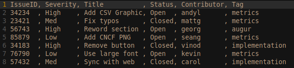

# Labor Investment by Organization

## 1. Description

Open source projects are often supported by organizations through labor
investment. This metric tracks the monetary investment of organizations (as
evident in labor costs) to individual projects.

## 2. Use Cases

This metric gives an Open Source Program Office (OSPO) manager a way to compare
contributed labor costs across a portfolio of projects.  

The OSPO manager can use the Labor Cost metric to:

- report labor costs of contributed vs in-house work
- compare project effectiveness across a portfolio of projects
- compare labor costs of open-source projects vs in-house efforts

## 3. Formula

Base metrics include:

- number of issues
- number of issues broken out by contributor types (internal / external)

Parameters include:

- hourly labor rate
- average labor hours to close an issue

Labor Investment = Number of Issues * Average labor hours to close an issue * Average hourly rate

## 4. Sample Filter and Visualization

Potential filters:

- internal vs external contributors
- issue tags
- project sources (eg internal, open-source repos, competitor open-source repos)

## 5. Sample Implementation

Our first implementation of parameterized metrics will rely on CSV exports.  We
will use spreadsheet for metric parameters and calculation formulas.  Future
implementations may add features for parameter manipulation directly in the
webapp.

## 6. Known Implementations

1. [Augur](https://github.com/chaoss/augur)

## 7. Test Cases (Examples)

1. Available in the Augur test schema for multiple repositories:

- Rails
- ReactJS
- SaltStack

## 8. External References (Literature)

- [Starting an Open Source Program Office][l1]
- [Creating an Open Source Program Office][l2]
- [Open Source in the Enterprise][l3]

[l1]: https://www.slideshare.net/caniszczyk/starting-an-open-source-program-office-ospo

[l2]: https://www.google.com/url?sa=t&rct=j&q=&esrc=s&source=web&cd=3&cad=rja&uact=8&ved=2ahUKEwi2rrDw_4LjAhWIsJ4KHRQVDokQFjACegQIAhAC&url=https%3A%2F%2Fevents.linuxfoundation.org%2Fwp-content%2Fuploads%2F2018%2F07%2FOSLS_2019-untold-story-of-OSPO.pdf&usg=AOvVaw3GHD5CghRseSw3LN6qFHWV

[l3]: https://www.google.com/url?sa=t&rct=j&q=&esrc=s&source=web&cd=4&cad=rja&uact=8&ved=2ahUKEwi2rrDw_4LjAhWIsJ4KHRQVDokQFjADegQIAxAC&url=https%3A%2F%2Fd1.awsstatic.com%2FOpen%2520Source%2Fenterprise-oss-book.pdf&usg=AOvVaw3S67m4n5tSngHYlnqjBp2B
