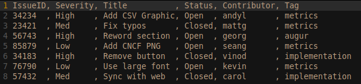

# Labor Investment

Question: What was the cost of an organization for its employees to create the counted contributions (e.g., commits, issues, and pull requests)?

## Description

Open source projects are often supported by organizations through labor investment. This metric tracks the monetary investment of organizations (as evident in labor costs) to individual projects.

## Objectives 

As organizational engagement with open source projects becomes increasingly important, it is important for organization to clearly understand their labor investment. The objective of this metric is to improve transparency in labor costs for organizations engaged with open source projects. This metric gives an Open Source Program Office (OSPO) manager a way to compare contributed labor costs across a portfolio of projects. For example, the Labor Investment metric can be used to prioritize investment or determine return on investment such as:

  * Labor Investment as a means of evaluating OSPO priorities and justifying budgets
  * Labor Investment as a way to explain product/program management priority
  * Labor Investment as an argument for the value of continued investing in OSPOs
  * Labor Investment to report and compare labor costs of contributed vs in-house work
  * Labor Investment to compare project effectiveness across a portfolio of projects

## Implementation

Base metrics include:

- Number of contributions
- Number of contributions broken out by contributor types (internal / external)
- Number of contributions broken out by contribution types (e.g., commits, issues, pull requests)

Parameters include:

- Hourly labor rate
- Average labor hours to create contribution (by contribution type)

Labor Investment = For each contribution type, sum (Number of contributions * Average labor hours to create contribution * Average hourly rate)

### Filters

* Internal vs external contributors
* Issue tags
* Project sources (e.g., internal, open-source repos, competitor open-source repos)

### Visualizations

Our first visualization of parameterized metrics rely on CSV exports that can be made available from Augur. Spreadsheets are used for metric parameters and calculation formulas.  Future implementations may add features for parameter manipulation directly in the webapp.

## References

- [Starting an Open Source Program Office][l1]
- [Creating an Open Source Program Office][l2]
- [Open Source in the Enterprise][l3]

[l1]: https://www.slideshare.net/caniszczyk/starting-an-open-source-program-office-ospo

[l2]: https://events19.linuxfoundation.org/wp-content/uploads/2018/07/OSLS_2019-untold-story-of-OSPO.pdf

[l3]: https://d1.awsstatic.com/Open%20Source/enterprise-oss-book.pdf
