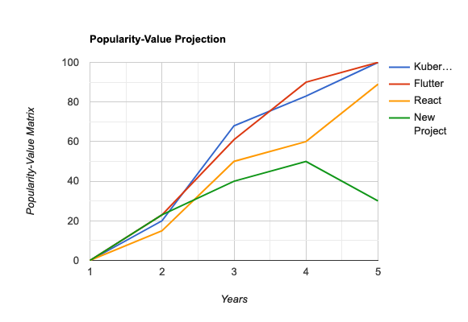

# Project Popularity & Living Wage

Question: How can we quantify the earnings potiential of a project, based on its popularity, that will signal the possibility of earning a living wage by contributing to the project?

## Description

One of the main issues with obtaining contributors or keeping them active on open source projects is the lack of funding. The old saying, "time is money" is very accurate. Nobody will continue contributing significant portions of their time without compensation, unless they have a real passion for the project(s). As a developer, being able to expand your skillset would make you more attractive to employers. If that skillset is at the forefront of some new process or technology, contributions to those projects could provide a living wage for many years to come.

## Objectives

This metric will provide visual representation of the potential for a given project to become a desired technology. This will but useful for contributors and for corporate interests alike.
* A contributor can use the metric to make an informed decision of which technologies could be in demand so they can add a desired skill which could lead to them aquiring a living wage through support of the project or through job offers.
* Companies can use this metric to make an informed decision as to which technologies may offer the best sustainability for their workflows, while giving them a reason to look for someone with a skillset in said technology.

## Implementation

Project popularity will be determined based on a number of factors:  
* Number of contributors  
* Contributions
* Pull requests
* Forks
* Aggregation of online discussion
* Factors from BOSS Index:  
	* Google score  
	* Job postings    

Using past successful projects as a baseline, differing weight values will be attributed to the factors of this metric to provide the most accurate portrait of project popularity, aka the popularity-value matrix. 

Some of the projects for this analysis would include: Kubernetes, Flutter, React, and Tensorflow among others. These projects seem to have been able to grow into modern technology solutions and proficiency in these applications will no doubt be seen as lucrative to potential employers. 

Augur currently tracks many different metrics that span periods of time. By visualizing the different factors listed above with these metrics over the period of time of their infancy to evolution you can correlate data points that support which factors will matter more than others as to the eventual adoption and potential success of a project.

Once that corellation is obtained, you can apply the weighted factors to newer OSS projects to have a better look at which projects will be potentially influential in the coming months/years, and pursue involvement in those that will provide the greatest opportunity for a living wage. 

### Filters  
* Projects that have a TBD number upswing in forks of their repo
* Projects that are trending updwards in their growth percentage of contributors over a TBD window of time
* Projects that have a TBD percentange of mentions through aggregation of online sites
* Projects that have a upswing in their Google Score by a TBD size

### Visualizations 

### Tools Providing the Metric 
[Augur](http://github.com/chaoss/augur) can be used to pull many different metrics that would be useful in calculating an appropriate popularity-value matrix
[Grimoirelab](http://github.com/chaoss/grimoirelab) also provides metrics and tools to fashion those into visualizations that make the data far more presentable and understandable to users who are seeking value projects. 

### Data Collection Strategies  
* Many CHAOSS metrics are currently obtaining the data necessary for this metric, and using their already established data collection tools will provide the information required.
* Pull the Google Score as displayed in the BOSS Index to use the search activity of a project in the calculation of the metric
* (I know this will be removed, wanted to add a talking point) Make a coordinated effort within CHAOSS to present a feature request to GitHub. If projects had "feature request" functionality, instead of treating everything as an 'issue', many different CHAOSS metrics would be able to utilize that data. Instead of a few different people submitting a request to GitHub, make it a concerted effort and present a formal paper with explaination and examples of how that data could only improve OSS metrics, thus their health, which only supports GitHub in the longer term. The text entry portion of the GitHub contact page doesn't seem to have a word limit, so that could be an avenue of submission, or more preferably send using industry contacts or conferences.

## References  

* Examine the pay for different skillsets [Salary by skill](http://payscale.com/research/US/Job=Software_Engineer/Skill)
* Explaination of the [BOSS Index](http://battery.com/powered/boss-index-tracking-explosive-growth-open-source-software/)
* Top 10 most popular OSS projects on Github [Top 10](http://insights.dice.com/2019/11/08/10-popular-open-source-projects-github)
